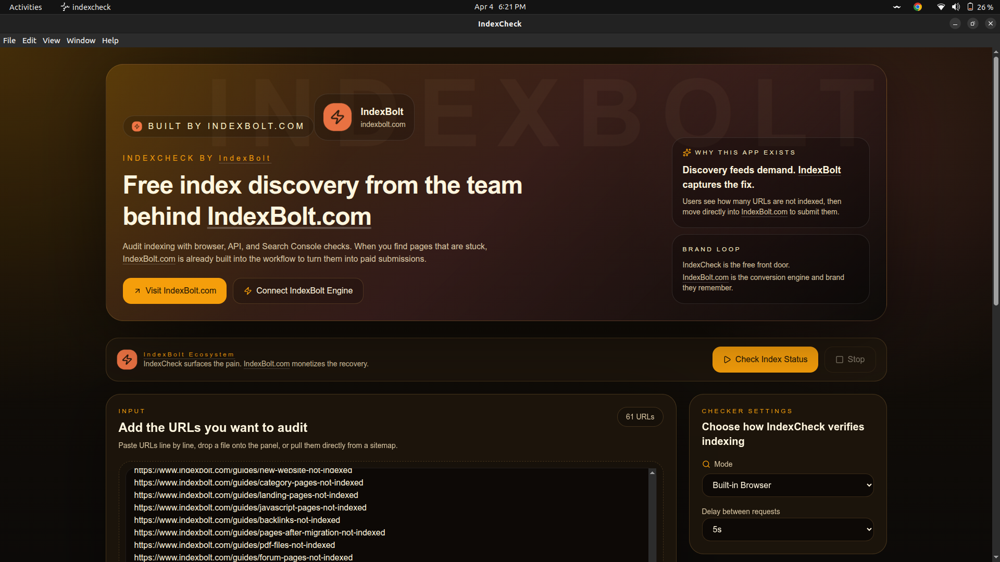
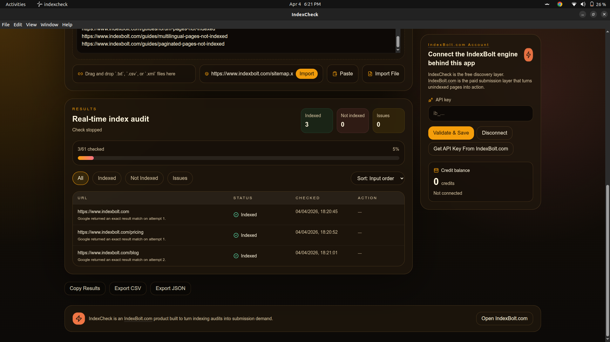
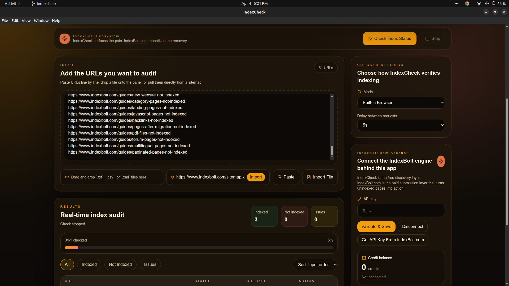

# Free Google Index Checker — Desktop App by [IndexBolt.com](https://www.indexbolt.com?utm_source=github&utm_medium=readme&utm_campaign=indexcheck_desktop)

**Check if your URLs are indexed by Google — for free, in bulk, with no limits.**

IndexCheck is a free desktop app that lets you check Google indexing status for any number of URLs. Built for SEOs, publishers, agencies, affiliate marketers, and anyone who needs to know which pages Google has indexed and which it hasn't.

No signup required. No usage caps. No browser extensions. Just download, run, and check.

---

## Download IndexCheck Desktop

| Platform | Download | Format |
|----------|----------|--------|
| **Linux** | [IndexCheck-0.1.0.AppImage](https://github.com/indexBolt-Fast-URL-Indexer/Free-Google-Index-Checker/releases/download/v0.1.0/IndexCheck-0.1.0.AppImage) | AppImage (universal) |
| **Linux (Debian/Ubuntu)** | [indexcheck_0.1.0_amd64.deb](https://github.com/indexBolt-Fast-URL-Indexer/Free-Google-Index-Checker/releases/download/v0.1.0/indexcheck_0.1.0_amd64.deb) | .deb package |
| **macOS** | Coming soon | .dmg |
| **Windows** | [IndexCheck Setup 0.1.0.exe](https://github.com/indexBolt-Fast-URL-Indexer/Free-Google-Index-Checker/releases/download/v0.1.0/IndexCheck.Setup.0.1.0.exe) | .exe installer |

> All downloads are available on the [Releases](https://github.com/indexBolt-Fast-URL-Indexer/Free-Google-Index-Checker/releases) page.

---

## Demo

<!-- Replace with actual video/gif path once added -->

---

## What Is a Google Index Checker?

A Google index checker tells you whether a specific URL appears in Google's search index. If a page is not indexed, it will never show up in search results — no matter how good the content is.

IndexCheck lets you do this at scale. Paste a list of URLs or import from a file or sitemap, and the app checks each one and tells you:

- **Indexed** — Google knows about this page
- **Not Indexed** — Google has not indexed this page
- **Error / CAPTCHA** — the check could not complete (retry or switch modes)

This is essential for:

- diagnosing traffic drops
- auditing new websites
- verifying backlinks are indexed
- checking pages after a site migration
- monitoring indexing progress over time

---

## Key Features

### Unlimited Free Index Checking

There are no daily limits, no credit systems, no paywalls on checking. Run as many checks as you need.

### Bulk URL Support

Paste URLs, import from a `.txt` or `.csv` file, drag-and-drop files into the app, or fetch URLs directly from a sitemap. Check hundreds or thousands of URLs in a single session.

### Three Checking Modes

IndexCheck supports three different methods to check indexing status, so you can choose the one that fits your workflow:

| Mode | How It Works | Best For |
|------|-------------|----------|
| **Browser Mode** | Uses the built-in browser to run `site:` searches on Google | Quick checks, no API keys needed |
| **SERP API Mode** | Uses external SERP providers (ScraperAPI, SerpAPI, or Serper) | High-volume checks without CAPTCHA risk |
| **Google Search Console Mode** | Connects to your own Google Search Console via OAuth | Most accurate results using the official URL Inspection API |

### Export and Filter Results

- Export results as **CSV** or **JSON**
- Copy results to clipboard
- Filter by status (indexed, not indexed, error)
- Separate indexed URLs from unindexed URLs for follow-up

### Google Search Console Integration

Connect your own Google Search Console account using OAuth and check indexing status through the official URL Inspection API. This gives you the most reliable and accurate results straight from Google.

### IndexBolt Integration

When you find unindexed URLs, you can submit them directly to [IndexBolt](https://www.indexbolt.com/register?utm_source=github&utm_medium=readme&utm_campaign=indexcheck_desktop) for faster indexing. IndexBolt handles the submission and crawl acceleration side — IndexCheck handles the free discovery side.

---

## Screenshots

| | |
|---|---|
|  |  |
|  |  |

<!-- Replace with actual screenshot paths once added -->

---

## How to Use IndexCheck Desktop

### Step 1 — Download and Install

Download the version for your operating system from the table above. On Linux, use the AppImage (no install needed — just make it executable and run) or install the `.deb` package.

### Step 2 — Add Your URLs

You have multiple ways to add URLs:

- **Paste** a list of URLs directly into the app
- **Import** from a `.txt` or `.csv` file using the file picker
- **Drag and drop** a file into the app window
- **Fetch from sitemap** by entering a sitemap URL

### Step 3 — Choose a Checking Mode

Pick one of the three modes:

- **Browser** — no setup needed, works out of the box
- **SERP API** — enter your API key from ScraperAPI, SerpAPI, or Serper
- **Google Search Console** — import your Google OAuth credentials and connect your account

### Step 4 — Run the Check

Hit start and watch the results come in. Each URL gets classified as indexed, not indexed, or error.

### Step 5 — Export or Take Action

Export your results as CSV or JSON. Use the filters to isolate unindexed URLs. Optionally, submit unindexed URLs to IndexBolt for indexing.

---

## Who Is This For?

- **SEO professionals** auditing client websites for indexing gaps
- **Content publishers** verifying that new articles are showing up in Google
- **Affiliate marketers** checking if money pages and backlinks are indexed
- **E-commerce store owners** making sure product pages are discoverable
- **Agencies** running bulk indexing audits across multiple domains
- **Developers** validating indexing after site migrations or redesigns
- **Link builders** confirming that backlinks are indexed and passing value

---

## Use Cases

### Check if Backlinks Are Indexed

Paste your backlink list and find out which links Google has indexed. Unindexed backlinks don't pass SEO value — knowing which ones are missing from Google's index helps you prioritize follow-up.

### Audit a Website After Migration

After a domain migration, URL structure change, or CMS switch, use IndexCheck to verify that your important pages made it into Google's index under their new URLs.

### Monitor Indexing for New Content

Published a batch of new blog posts or product pages? Run a check to confirm Google has picked them up. Catch indexing delays early before they become traffic problems.

### Validate Google Search Console Data

Use the GSC mode to cross-check indexing status using the official URL Inspection API. This gives you the same data Google shows in Search Console, but in bulk.

### Separate Indexed from Unindexed URLs

Import a large URL list, run the check, and export only the unindexed URLs. Use that filtered list for resubmission, internal linking improvements, or content updates.

---

## Frequently Asked Questions

### Is this really free?

Yes. IndexCheck is free to download and use with no limits on how many URLs you can check. There are no hidden costs for the checking functionality.

### Do I need an API key?

Only if you choose SERP API mode. Browser mode works without any setup. Google Search Console mode requires your own Google OAuth credentials (free to create).

### Is this a Google indexing tool or a Google index checker?

IndexCheck is a **checker** — it tells you whether URLs are indexed. It does not submit URLs to Google for indexing. If you need to submit URLs for faster indexing, you can use the built-in [IndexBolt](https://www.indexbolt.com?utm_source=github&utm_medium=readme&utm_campaign=indexcheck_desktop) integration.

### Can I check thousands of URLs?

Yes. There is no hard limit on the number of URLs. Import from files or sitemaps and let the app run through them. In SERP API or GSC mode, you can check large lists without CAPTCHA interruptions.

### What happens if I get a CAPTCHA in Browser mode?

Browser mode runs `site:` searches through a built-in browser, which means Google may show a CAPTCHA if you check too many URLs too quickly. You can adjust the delay between checks in settings, or switch to SERP API or GSC mode to avoid CAPTCHAs entirely.

### Does this work on Mac and Windows?

macOS and Windows versions are coming soon. Currently, Linux builds (AppImage and .deb) are available.

### Is my data stored anywhere?

All data stays on your local machine. IndexCheck does not send your URLs to any server (except to the SERP provider you choose in SERP API mode, or to Google in GSC mode). Settings and credentials are stored locally using encrypted storage when available.

---

## IndexCheck vs Other Google Index Checkers

| Feature | IndexCheck Desktop | Online Index Checkers |
|---------|-------------------|----------------------|
| Price | Free | Often limited free tiers |
| URL limits | Unlimited | Typically 10–100 per day |
| Bulk checking | Yes | Varies |
| Offline capable | Yes (Browser mode) | No |
| Google Search Console integration | Yes | Rare |
| Data privacy | Local only | URLs sent to third-party servers |
| Export options | CSV, JSON, clipboard | Varies |
| No signup required | Yes | Usually requires account |

---

## Links

- **IndexBolt** — [indexbolt.com](https://www.indexbolt.com?utm_source=github&utm_medium=readme&utm_campaign=indexcheck_desktop)
- **Unlimited Free Google Indexer** — [indexbolt.com/unlimited-free-google-indexer](https://www.indexbolt.com/unlimited-free-google-indexer?utm_source=github&utm_medium=readme&utm_campaign=indexcheck_desktop)
- **Google Index Checker Tool** — [indexbolt.com/tools/google-index-checker](https://www.indexbolt.com/tools/google-index-checker?utm_source=github&utm_medium=readme&utm_campaign=indexcheck_desktop)
- **IndexBolt Pricing** — [indexbolt.com/pricing](https://www.indexbolt.com/pricing?utm_source=github&utm_medium=readme&utm_campaign=indexcheck_desktop)

---

## License

This software is distributed under a proprietary license. See [LICENSE](./LICENSE) for details.

---

**Made by [IndexBolt.com](https://www.indexbolt.com?utm_source=github&utm_medium=readme&utm_campaign=indexcheck_desktop)** — the fastest way to get your pages indexed by Google.
